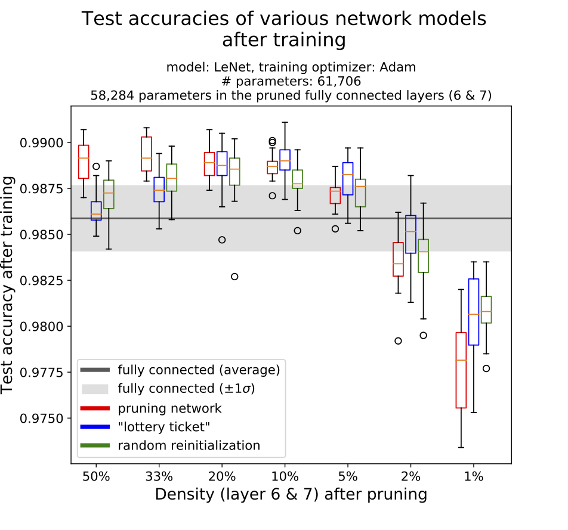

# Theys96/lottery-ticket-hypothesis
Experimentation setup for the "Lottery Ticket" hypothesis for neural networks.

---

The lottery ticket hypothesis refers to an idea relating to neural network pruning, first proposed by Frankle and Carbin in 2019 (J. Frankle and M. Carbin. The lottery ticket hypothesis: Training pruned neural networks. CoRR, abs/1803.03635, 2018. URL [http://arxiv.org/abs/1803.03635](http://arxiv.org/abs/1803.03635). Accessed: February 2020.). With the code in this repository, we experimented on this hypothesis with a LeNet model on the MNIST dataset. 

Consider the following figure.

We can interpret the figure above as this: When leveraging the "lottery ticket" principle after pruning the selected neural network model (LeNet) down to -say- 5% density, we achieve a higher test accuracy (compared to the original fully dense model or another pruning approach). The subject dataset is MNIST, by the way. 

Check out our complete [report](report/An Analysis of Neural Network Pruning in Relation to the Lottery Ticket Hypothesis -- Havinga Sawnhey.pdf) for more information.